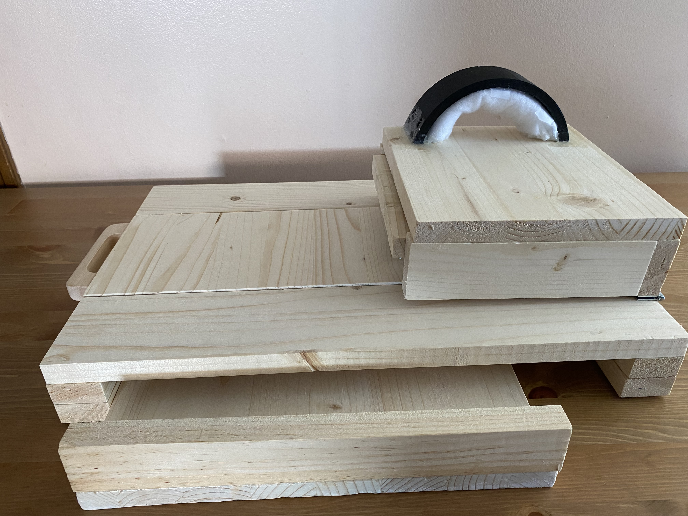
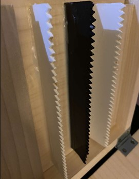
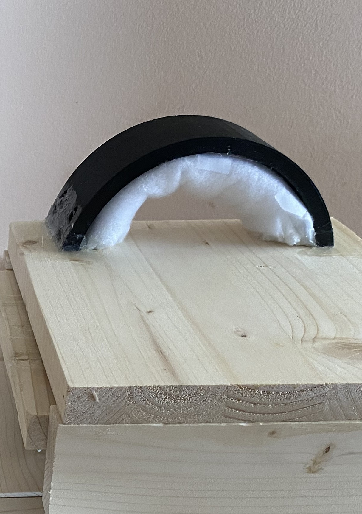
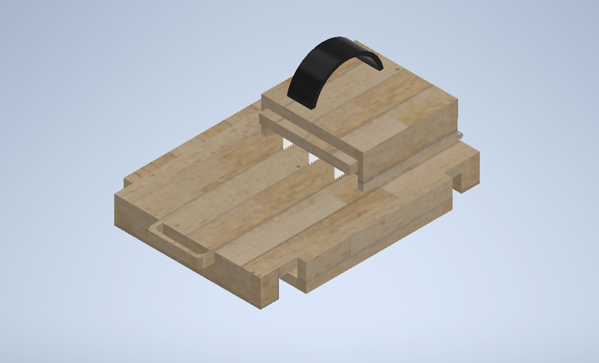
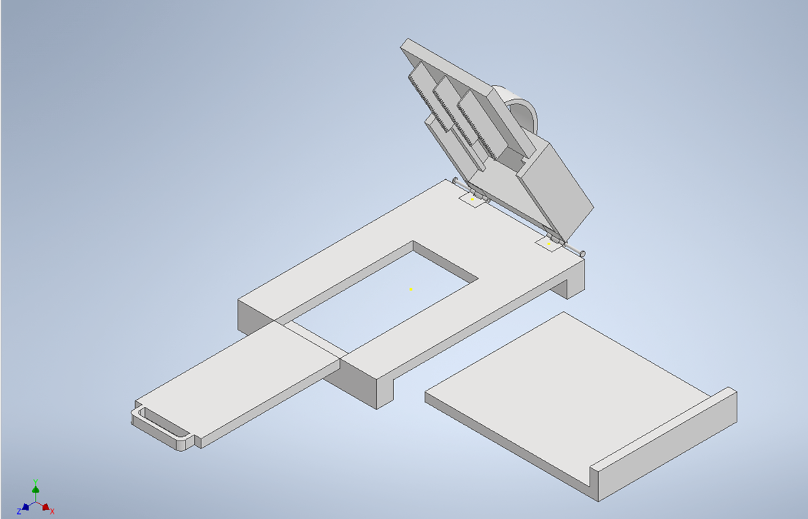

# Mechanical Cutting Device: Adaptive Fold Over Slicer

McMaster ENGINEER 1P13, Mar 2022 – Apr 2022.

Ergonomic fold over slicer designed for a client with Ehlers Danlos Syndrome to reduce joint strain and lateral hand movement during food preparation.

`Autodesk Inventor` `3D Printing` `Woodworking` `Assistive Design` `PLA` 

 
<em>Fully Assembled Cutting Device with the Cutting Board, Drawer, Slicer, and Strap.</em>

---

## Table of Contents
- [Overview](#overview)
- [Design Requirements](#design-requirements)
- [Components & Materials](#components--materials)
- [Design Details](#design-details)
  - [1. Hand Support & Ergonomics](#1-hand-support--ergonomics)
  - [2. Cutting Mechanism](#2-cutting-mechanism)
  - [3. Food Collection & Board](#3-food-collection--board)
  - [4. Assembly & Modular Hardware](#4-assembly--modular-hardware)
- [How to Use](#how-to-use)
- [CAD & Engineering Drawings](#cad--engineering-drawings)
- [Results](#results)
- [Limitations & Future Improvements](#limitations--future-improvements)
- [Full Report](#full-report)

---

## Overview

This project was built for a client living with Ehlers Danlos Syndrome (EDS), a connective tissue condition that makes gripping and applying force through the hand joints painful during everyday tasks such as cutting food. Standard knives require bending the fingers around a handle and pushing downward, placing significant strain on the carpometacarpal and metacarpophalangeal joints. The finished device is a fold over slicer attached to a cutting board, letting the client prepare food with a flat hand placement and without the lateral cutting motion required by a standard knife. Main components include a wooden cutting board with a sliding cutout and drawer, a hinged slicer with a cushioned wrist strap, detachable 3D printed blades, and a modular pin and hinge assembly.

---

## Design Requirements

The device was designed around three main objectives, each tied to a client focused constraint:

| Objective | Constraint |
|---|---|
| Ergonomic | Hand stays flat during operation, with rounded edges and support rather than a device that takes over the client's motion entirely. |
| Lightweight | Overall weight kept under 5 pounds so the client could carry the device easily. |
| Adaptive | Blades detachable and food safe, capable of cutting a range of small food products. |

Requirements were identified through client interviews and direct hand measurements taken early in the design process, and were used to size the slicer strap and hand rest to the client's own hand.

---

## Components & Materials

| Design Component | Material | Quantity | Cost |
|---|---|---|---|
| Cutting Board, Cutout, Cutout Handle, Drawer Handle, Drawer, Slicer, Insert Piece | Wood | 6 | $86.53 |
| Blades | PLA | 3 | $0.00 |
| Slicer Strap | PLA | 1 | $0.00 |
| No-Slip Stoppers | Plastic | 6 | $0.00 |
| Hinges | Metal | 2 | $0.00 |
| Nails | Metal | 8 | $0.00 |
| Slicer Strap Lining | Cotton | 1 | $0.00 |
| **Total Cost** | | | **$86.53** |

Wood formed the main structural components, PLA was 3D printed for the blades and slicer strap for its food safety, durability, and ease of reprinting at home, and metal hinges and nails secured the slicer to the board.

  
  

<em>3D Printed Blades in a Square Orientation for Cutting Versatility, and the Slicer Strap with Cotton Lining.</em>

---

## Design Details

### 1. Hand Support & Ergonomics

- Small divots were sanded into the slicer surface to match the client's hand shape and support the carpometacarpal and metacarpophalangeal joints.
- The slicer strap was sized to about 5 inches wide, using measurements taken directly from the client's hand, so it could fit comfortably with ease.
- Cotton lining under the strap and rounded, sanded edges where the client grips the slicer were incorporated to reduce the pressure points and discomfort during use.

### 2. Cutting Mechanism

- The blades sit in a square orientation within a removable blade insert, allowing versatility while cutting and easy replacement.
- Blades are 3D printed with PLA, chosen for its food safety and durability while remaining easy to reprint at home if replacement is needed.
- Rotating the slicer downward onto the food, rather than the lateral motion of a standard knife, replaces the standard cutting grip with a single controlled motion.

### 3. Food Collection & Board

- Cut food drops through a sliding cutout in the cutting board into a removable drawer positioned underneath.
- A handle built into the cutout piece allows the client to pull it out easily to retrieve cut food.
- Rubber and plastic no slip stoppers on the underside of the board keep it stable on kitchen counters during use.

### 4. Assembly & Modular Hardware

- A modular pin and hinge assembly connects the slicer to the cutting board, allowing the slicer to be attached, folded down to cut, and detached for storage.
- All detachable components, including the blades, blade insert, and slicer assembly, are dishwasher safe for cleaning.
- Metal hinges and nails were chosen for their durability, needing to withstand both the weight of the slicer and the downward force of the client's hand during use.

---

## How to Use

1. Place the cutting board on a flat, stable surface.
2. Slide the cutout piece into the board and secure it in place.
3. Attach the slicer to the cutting board by placing the pins through the hinges.
4. Insert the blade assembly, with the blades attached, into the slicer's blade insert.
5. Slide a hand under the slicer strap so it rests flat against the padded, cushioned surface.
6. Grip the sides of the slicer and rotate it downward so the blades cut the food resting on the board below.
7. Pull the cutout handle outward to let the cut food drop into the drawer below, then remove the drawer to retrieve it.

<video src="https://github.com/user-attachments/assets/4832cd9b-568e-46df-9fab-643e632cbbba" controls></video>

<em>Demonstration of the Mechanical Cutting Device being used to cut food, from Attaching the Slicer to Retrieving cut food from the Drawer.</em>

---

## CAD & Engineering Drawings

The cutting board and slicer were modeled in Autodesk Inventor using measurements taken from the refined initial prototype, then fabricated through a combination of woodworking and 3D printing.

  
  

<em>CAD Model of the Final Refined Prototype Assembled, and with the Components Exploded.</em>

  
  

<em>Engineering Drawing of Strap (left) and Blades (right), in mm.</em>

  
  

<em>Engineering Drawing of Cutting Board (left) and Drawer (right), in mm.</em>

  
  

<em>Engineering Drawing of Blade Insert Holder (left) and Blade Holder (right), in mm.</em>

---

## Results

- The device successfully functioned as a working assistive cutting tool, allowing the client to prepare food using a flat hand position with reduced lateral movement and joint strain compared to a standard knife.
- Testing with reviewers indicated a lower estimated injury rate than cutting with a regular knife.
- The prototype weighed approximately 2 kilograms, meeting the lightweight objective of staying under 5 pounds.
- Testing confirmed the design could adaptively cut a range of small food products, including bananas, grapes, kiwi, and strawberries.

---

## Limitations & Future Improvements

- Blades were 3D printed with PLA and a serrated edge, which demonstrated the design's functionality but would need to move to a plastic or metal blade for a sharper, more commercial grade cut.
- No guard or cover was fabricated for the blades due to project time constraints, though it was identified as a valuable safety addition.
- The height of the cutting board was only estimated from the client's body measurements; having the client test the device directly and adjust for comfort would be a more reliable input.
- An adjustable height mechanism was considered so other members of the client's household could use the device, but was not implemented within the project timeline.
- More food safe materials, such as different cuts or polished wood, were identified as an improvement if given an increased budget.

---

## Full Report

[Read the Full Project Report](Files/Mechanical_Cutting_Device_Report.pdf)
